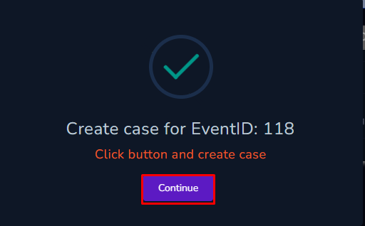

# WriteUp---SOC168---Whoami-Command-Detected-in-Request-Body
* *This repository contains the writeup to a practice case for SOC-Analyst at LetsDefend.io. Writeup includes a thorough detail of command injection attack and how the detection was successful.*
* *All the questions from the playbook after creatring and owning the case have been answered in this writeup one by one with details shown in the screenshot.*
# Create a New Case and Start PlayBook

